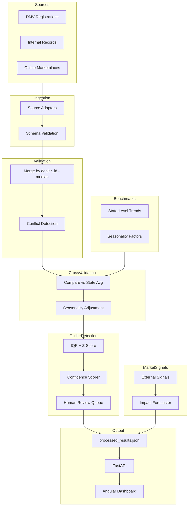

# Architecture: Data Validation & Market Insights

## Overview

The system has 6 layers. Data flows top to bottom — each layer adds validation or enrichment, and nothing auto-corrects values. Everything flagged goes to human review.

## Diagram

```
  DMV data ──┐
  Internal ──┼──► INGESTION (schema validation, source tagging)
  Marketplace┘          │
                        ▼
                   MERGE (median across sources, flag discrepancies)
                        │
         State trends ──┼──► CROSS-VALIDATION (vs state avg, seasonality adjustment)
         Seasonality  ──┘          │
                                   ▼
                              OUTLIER DETECTION (IQR + z-score → confidence 0-1)
                                   │
         Competitor signals ──┐    │
         Supply chain ────────┼──► MARKET SIGNALS (forecast revenue impact)
         Economic indicators──┘    │
                                   ▼
                              OUTPUT (JSON → FastAPI → Angular dashboard)
```

For the formal Mermaid version:



## Why these choices

### Ingestion: Per-source CSV adapters

Each source (DMV, internal, marketplace) has its own file with the same schema but different values. I keep them separate and tag each with the source name so we can trace back where a number came from. Schema validation catches missing columns or wrong types before anything else runs.

Could scale to API-based ingestion or a message queue (Kafka) if sources push data in real-time, but for this scope CSV files work fine.

### Merge: Median, not average

When 3 sources report different revenue for the same dealer, I use the median — not the average. Average gets pulled by one extreme value. Median means if 2 out of 3 sources agree, the odd one out doesn't distort the result.

I also compute the standard deviation across sources. If the coefficient of variation exceeds 10%, it's flagged as a conflict. The flag goes to human review — the system doesn't pick a "correct" value.

### Cross-validation: State benchmarks + seasonality

Each dealer's revenue is compared to their state's average. If a dealer in Florida does 5x the Florida average, that's worth looking at. The threshold is 0.5x to 2.0x (configurable).

Seasonality index prevents false flags — December sales are naturally higher, so we normalize before comparing.

### Outlier detection: IQR + confidence scoring

IQR (interquartile range) is a standard statistical method. Values outside Q1-1.5*IQR or Q3+1.5*IQR are flagged.

The confidence score (0 to 1) combines three independent signals:
- **Statistical strength (40%)** — how many standard deviations from mean (z-score). Higher z = more confident.
- **Source agreement (30%)** — if multiple sources all report similar values, the median is reliable. If only 1 source, less confident.
- **Benchmark confirmation (30%)** — if state benchmarks also flag this dealer, the outlier is more likely real.

This way reviewers can prioritize: a 0.88 confidence outlier gets attention before a 0.4.

No values are ever changed. This is intentional — the task says "not auto-correction."

### Market signals: Config-driven impact

External signals (supply chain issues, competitor launches, rate changes) are defined in a JSON file with a percentage effect on revenue. The forecaster sums them and applies to total revenue.

Simple approach, but it shows the connection between external events and internal metrics. In production you'd want per-region or per-segment elasticity models.

### Output: JSON → FastAPI → Angular

The pipeline writes one JSON file. The API reads it and serves endpoints. The dashboard calls the API. Clean separation — you could swap the frontend or add more API consumers without touching the pipeline.

## What I'd add with more time

- Real database instead of JSON file (Postgres or even SQLite)
- Per-dealer market signal impact (not just aggregate)
- Historical trend comparison (is this dealer declining or growing?)
- Airflow or similar scheduler instead of manual/cron runs
- ML-based anomaly detection (Isolation Forest) alongside IQR
- Authentication on the API
- More Kaggle datasets integrated for a richer demo
