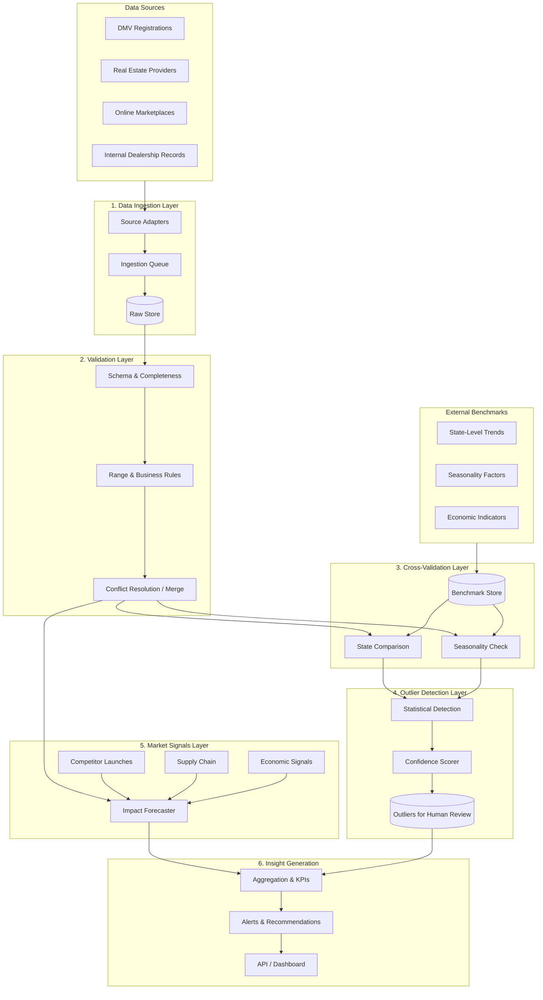

# JumpIQ: Data Validation & Market Insights Architecture

**Purpose:** Scalable architecture to ingest dealership data from multiple sources, cross-validate against external benchmarks, flag outliers with confidence scores for human review, and connect market signals to internal parameters for impact forecasting.

---

## 1. High-Level Architecture Diagram

---

## 2. Component Selection & Justification

### 2.1 Data Ingestion Layer

| Component | Choice | Justification |
|-----------|--------|---------------|
| **Source adapters** | Per-source connectors (API, file, DB) | Each source (DMV, real estate, marketplaces, internal) has different formats and SLAs; adapters isolate schema mapping and error handling. |
| **Ingestion queue** | Message queue (e.g. Kafka / RabbitMQ) or file-based queue | Decouples producers from consumers; allows backpressure and replay; in smaller deployments a scheduled job + shared storage is sufficient. |
| **Raw store** | Object store (S3/GCS) or partitioned files (Parquet/CSV) | Immutable raw data for reprocessing and audit; partitioning by source and date enables incremental loads and cost control. |

**Scalability:** Add new sources by adding adapters; scale ingestion horizontally with more consumers.

---

### 2.2 Validation Layer

| Component | Choice | Justification |
|-----------|--------|---------------|
| **Schema & completeness** | Schema registry + validation (e.g. JSON Schema, Pydantic, Great Expectations) | Ensures required fields and types before downstream logic; catches source schema drift early. |
| **Range & business rules** | Rule engine (config-driven thresholds) | Validates numeric ranges (e.g. margin %, turnover), referential integrity (state codes, dealer IDs), and simple business rules. |
| **Conflict resolution / merge** | Deterministic merge (e.g. latest-by-timestamp, source priority, or median across sources) | Multiple sources report “slightly different figures”; merge policy must be explicit and auditable. No auto-correction: conflicts can feed into outlier/review pipeline. |

**Human review:** Invalid or conflicting records are flagged with reason codes and pushed to the outlier/review store, not auto-corrected.

---

### 2.3 Cross-Validation (Benchmarks) Layer

| Component | Choice | Justification |
|-----------|--------|---------------|
| **State-level trends** | Precomputed state aggregates (e.g. state avg revenue, registrations) updated periodically | Cross-validate dealer-level metrics against regional norms; deviations beyond a band (e.g. ±2σ) become candidate outliers. |
| **Seasonality** | Month/quarter factors (e.g. index vs annual average) | Normalize for seasonality before comparing; avoids flagging normal seasonal swings as outliers. |
| **Benchmark store** | Table/API (DB or file) with state, segment, and time dimensions | Single place to update benchmarks (from internal analytics or external vendors); versioned for reprocessing. |

**Output:** Per-record deviation scores vs benchmark (e.g. “revenue 1.8× state avg”) and a flag when outside acceptable band.

---

### 2.4 Outlier Detection Layer

| Component | Choice | Justification |
|-----------|--------|---------------|
| **Statistical detection** | IQR, Z-score, or MAD on key metrics (revenue, margin, turnover) | Simple, interpretable, and robust for unimodal metrics; can run per segment/state to avoid mixing regimes. |
| **Confidence scorer** | Score 0–1 from distance, consistency across sources, and benchmark deviation | Prioritizes human review: high-confidence outliers first; low-confidence can be batched or deprioritized. |
| **Outliers for human review** | Dedicated store (DB table or export) with no auto-correction | Aligns with requirement: “flags outliers with confidence scores for human review (not auto-correction).” |

**Scalability:** Replace or complement with ML-based anomaly detection (e.g. Isolation Forest, Prophet) as data volume grows.

---

### 2.5 Market Signals Layer

| Component | Choice | Justification |
|-----------|--------|---------------|
| **Signal ingestion** | Feeds for competitor launches, supply chain events, economic indicators | External context to interpret internal metrics and forecast impact. |
| **Impact forecaster** | Rule-based or light model (e.g. elasticity, segment multipliers) | Maps signals to internal parameters (e.g. “supply disruption → +X% cost, -Y% volume”); outputs scenario or point impact for downstream insights. |

**Integration:** Signals and impact outputs are connected to the insight layer so dashboards can show “market context” and “forecast impact” alongside validated metrics and outliers.

---

### 2.6 Insight Generation Layer

| Component | Choice | Justification |
|-----------|--------|---------------|
| **Aggregation & KPIs** | Validated + merged data aggregated by segment, state, time | Enables valuations, competitive scoring, momentum metrics, and market insights (per JumpIQ intro). |
| **Alerts & recommendations** | Rule-based alerts on outliers, thresholds, and signal-driven impacts | Surfaces what needs human review and what might need action. |
| **API / Dashboard** | REST API + Angular (or similar) dashboard | Serves validated data, outlier list with confidence, and market-impact summaries to analysts and M&A workflows. |

---

## 3. Data Flow Summary

1. **Ingest** — Multi-source data (DMV, real estate, marketplaces, internal) → raw store with source tag.
2. **Validate** — Schema, range, and business rules; merge with explicit conflict policy; invalid/conflict records flagged.
3. **Cross-validate** — Compare vs state-level trends and seasonality; compute deviation flags.
4. **Outlier detection** — Statistical detection on key metrics → confidence score → **human review store (no auto-correction)**.
5. **Market signals** — Ingest external signals; run impact forecaster; attach to internal parameters.
6. **Insights** — Aggregate validated data, attach outliers and impact; expose via API and dashboard.

---

## 4. Technology Mapping (Example)

| Layer | Example stack | Notes |
|-------|----------------|------|
| Ingestion | Python + Pandas / Polars, Airflow or cron | File/API adapters; optional Kafka for scale. |
| Validation | Pydantic, Great Expectations, config-driven rules | Same codebase can support larger validators. |
| Benchmarks | SQLite / Postgres or Parquet | State/seasonality tables updated by separate job. |
| Outlier | Scipy / statsmodels (IQR, z-score) | Optional: scikit-learn Isolation Forest, Prophet. |
| Signals | Config + small Python module | Optional: event stream + real-time scoring. |
| API & UI | FastAPI + Angular | Already implemented in this repo. |

---

## 5. Running This Repo with Sample / Kaggle Data

- **Sample data:** `data/` includes multi-source CSVs and `data/benchmarks/` for state and seasonality; the pipeline runs end-to-end (ingestion → validation → cross-validation → outlier with confidence → insights).
- **Kaggle:** Use datasets such as **US used car sales data** (tsaustin), **US Sales Cars Dataset** (juanmerinobermejo), or **US Motor Vehicle Registrations**; see `docs/KAGGLE_DATA.md` for column mapping and where to place files so the same architecture runs on Kaggle-sourced data.

This architecture is designed to scale from file-based proof-of-concept (as in this repo) to queue-based, distributed ingestion and richer ML-based outlier and impact models.
